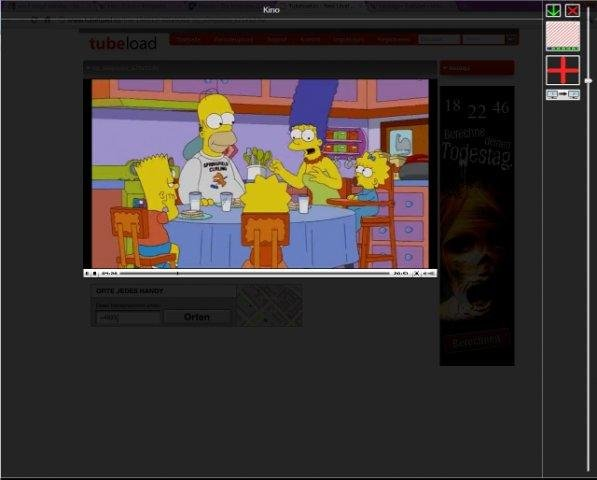
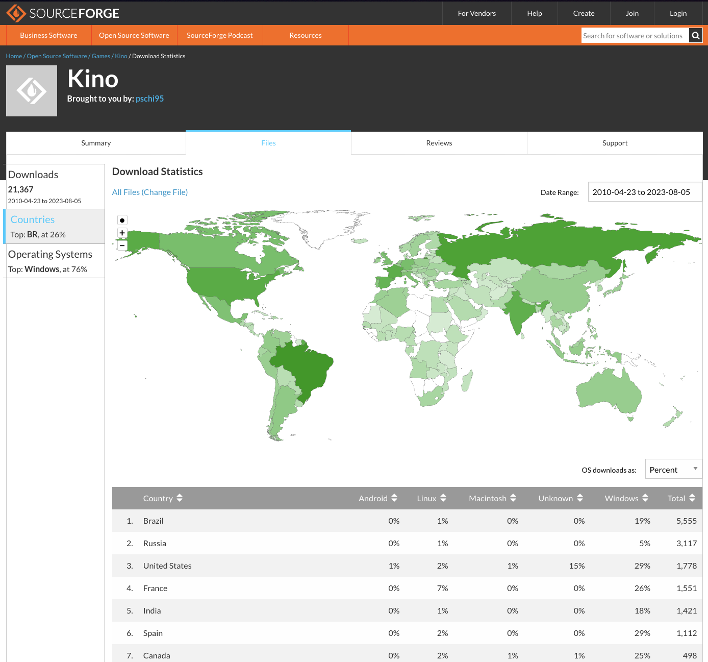

# Kino

A program that darkens the whole screen, except for a user-defined area (which may include a video) for keeping the contrast if the background is too bright or for hiding ads. It also works with several screens.

This repository mirrors the SourceForge project:
https://sourceforge.net/projects/pskino/

## Releases

The installer and original source archive are attached to the [v1.6.0 GitHub release](https://github.com/phischdev/kino/releases/tag/v1.6.0).

## Source tree

- The archived source is available directly in this repository.

The source tree was imported from the `Kino 1.6.0.zip` SourceForge release and the release artifacts were mirrored from the files page.

## SourceForge download statistics

